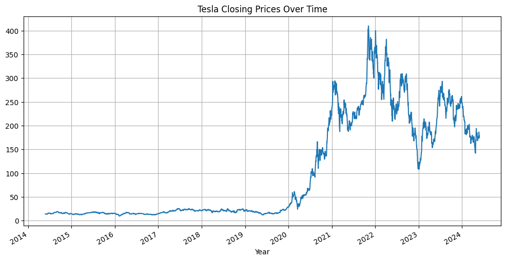

# ARIMA-Model-Time-Series-Stock-Forecasting
Python Portfolio Exercise

Load the dataset TLSA stock close price 2014-2024
 
 
Time series forecasting is a method used to predict future values based on previously observed values in a time-ordered sequence (for example Stock prices) 
In this project, the focus would be on the ARIMA model and how it can be used to make stock prices prediction 
### ARIMA
**AutoRegressive (AR) part:**  uses the stock's past prices to predict its future prices. This assumes that past prices have a linear relationship with future prices. 
**Integrated (I) part:** The 'Integrated' part addresses this by differencing the stock price series to remove trends and achieve stationarity. 
**Moving Average (MA) Component:** The MA component captures the relationship between an observation and a residual error from a moving average model applied to lagged observations. 

### Checking for Stationarity
Using statistical tests like the Augmented Dickey-Fuller (ADF) test.
 
*    We see that the p-value is greater than 0.05 so we cannot reject the Null hypothesis. 
*    The absolute value of -1.359154 is relatively low compared to the critical values, suggesting that the time series is not stationary.

### Eliminate Trend and Seasonality###
**Apply from statsmodels.tsa.seasonal import seasonal_decompose**
**Apply logarithm transformation**

## Split the Data into Train and Test
